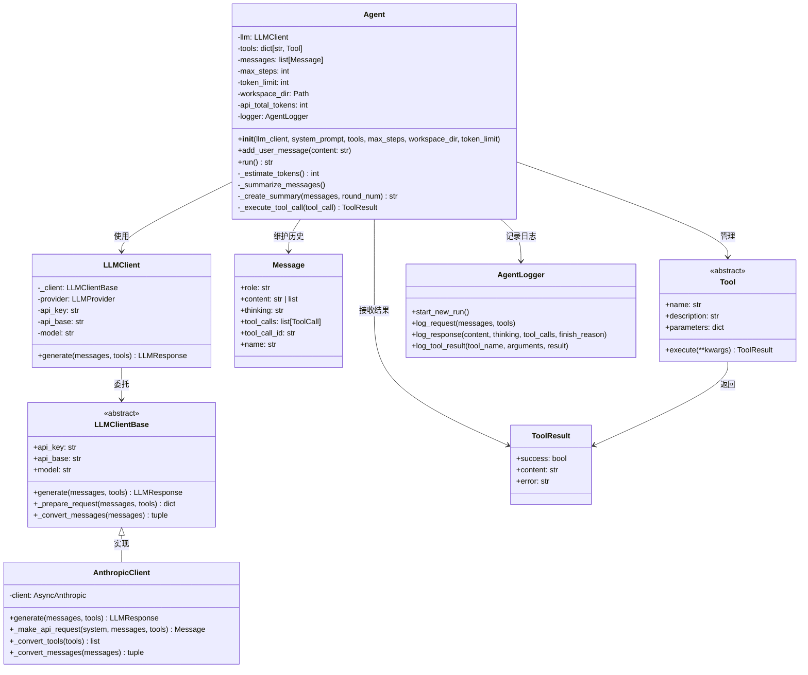
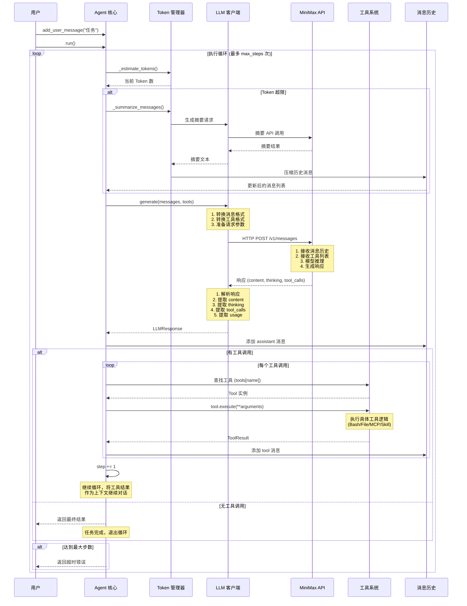
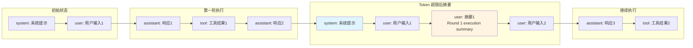
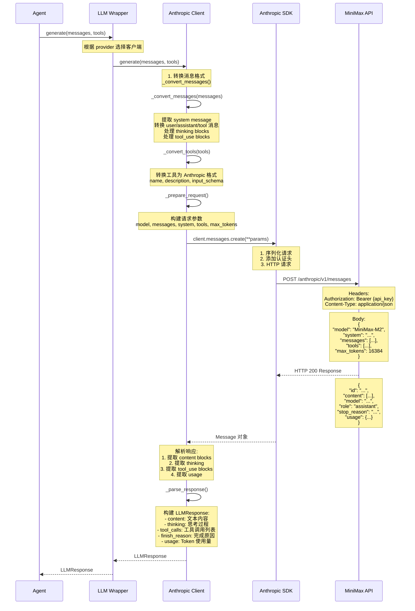
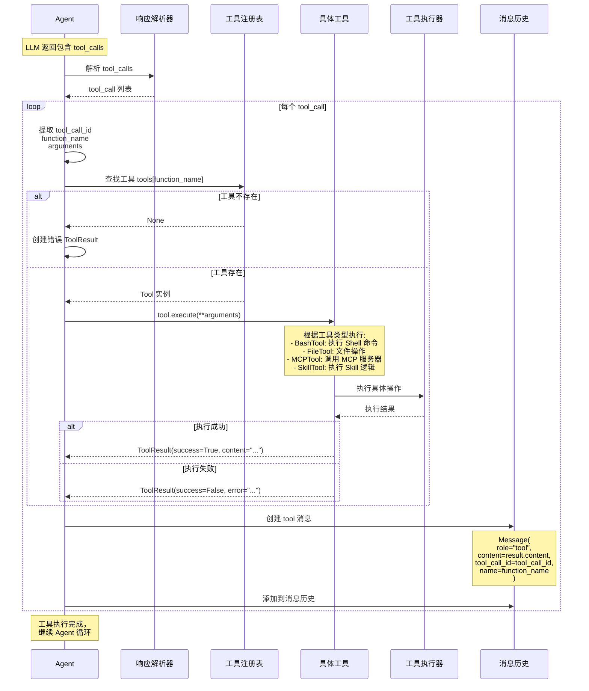
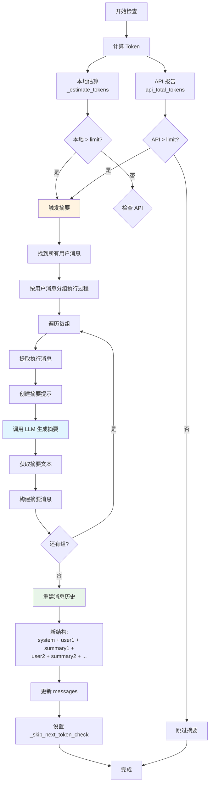
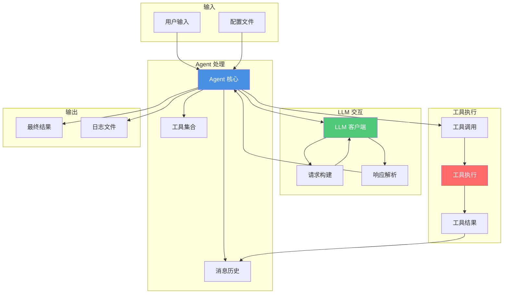

# Agent 核心架构与大模型交互流程

## Agent 核心架构图



## Agent 内部结构详细图

```mermaid
graph TB
    subgraph "Agent 核心组件"
        A[Agent 实例]
        
        subgraph "状态管理"
            M[消息历史<br/>messages: List[Message]]
            T[工具字典<br/>tools: dict[str, Tool]]
            W[工作空间<br/>workspace_dir: Path]
        end
        
        subgraph "Token 管理"
            TE[Token 估算器<br/>_estimate_tokens]
            TS[摘要触发器<br/>_summarize_messages]
            CS[摘要生成器<br/>_create_summary]
            AT[API Token 计数<br/>api_total_tokens]
        end
        
        subgraph "执行控制"
            EC[执行循环<br/>run method]
            SC[步数计数器<br/>step]
            MS[最大步数<br/>max_steps]
        end
        
        subgraph "工具执行"
            TC[工具调用解析器]
            TE2[工具执行器<br/>_execute_tool_call]
            TR[工具结果处理]
        end
        
        subgraph "日志系统"
            L[AgentLogger]
            LR[请求日志]
            LRES[响应日志]
            LT[工具日志]
        end
    end
    
    A --> M
    A --> T
    A --> W
    A --> TE
    A --> TS
    A --> CS
    A --> AT
    A --> EC
    EC --> SC
    EC --> MS
    EC --> TC
    TC --> TE2
    TE2 --> TR
    A --> L
    L --> LR
    L --> LRES
    L --> LT
    
    TS --> TE
    TS --> CS
    CS --> TE
```

## Agent 与大模型交互完整流程



## Agent 执行循环详细流程

```mermaid
flowchart TD
    Start([开始: run方法]) --> Init[初始化: step = 0]
    Init --> Loop{step < max_steps?}
    
    Loop -->|是| CheckToken[检查 Token 限制]
    CheckToken --> Estimate[_estimate_tokens计算Token]
    Estimate --> Compare{Token > limit?}
    
    Compare -->|是| Summarize[触发摘要]
    Summarize --> FindUsers[找到所有用户消息索引]
    FindUsers --> CreateSummary[为每轮执行创建摘要]
    CreateSummary --> CallLLM[调用 LLM 生成摘要]
    CallLLM --> UpdateHistory[更新消息历史]
    UpdateHistory --> PrepareLLM[准备 LLM 调用]
    
    Compare -->|否| PrepareLLM
    PrepareLLM --> LogRequest[记录请求日志]
    LogRequest --> CallLLM2[调用 llm.generate]
    
    CallLLM2 --> ParseResponse[解析 LLM 响应]
    ParseResponse --> LogResponse[记录响应日志]
    LogResponse --> AddAssistantMsg[添加 assistant 消息到历史]
    AddAssistantMsg --> CheckToolCalls{有工具调用?}
    
    CheckToolCalls -->|否| ReturnResult[返回最终结果]
    ReturnResult --> End([结束])
    
    CheckToolCalls -->|是| LoopTools[遍历每个工具调用]
    LoopTools --> FindTool[查找工具 tools[name]]
    FindTool --> ValidateArgs[验证参数]
    ValidateArgs --> ExecuteTool[执行工具 tool.execute]
    ExecuteTool --> LogTool[记录工具执行日志]
    LogTool --> AddToolMsg[添加 tool 消息到历史]
    AddToolMsg --> MoreTools{还有工具?}
    
    MoreTools -->|是| LoopTools
    MoreTools -->|否| IncrementStep[step += 1]
    IncrementStep --> Loop
    
    Loop -->|否| MaxSteps[达到最大步数]
    MaxSteps --> ReturnError[返回错误信息]
    ReturnError --> End
    
    style Start fill:#e1f5ff
    style End fill:#e1f5ff
    style Summarize fill:#fff4e1
    style ExecuteTool fill:#e8f5e9
    style ReturnResult fill:#c8e6c9
```

## 消息历史结构演变



## LLM 客户端交互细节



## 工具调用详细流程



## Token 管理机制



## 数据流图



## 关键数据结构

### Message 结构
```python
Message(
    role: str,              # "system" | "user" | "assistant" | "tool"
    content: str | list,    # 消息内容
    thinking: str,          # 思考过程（仅 assistant）
    tool_calls: list,       # 工具调用列表（仅 assistant）
    tool_call_id: str,      # 工具调用 ID（仅 tool）
    name: str               # 工具名称（仅 tool）
)
```

### LLMResponse 结构
```python
LLMResponse(
    content: str,           # 文本响应
    thinking: str,          # 思考过程
    tool_calls: list,       # 工具调用列表
    finish_reason: str,     # 完成原因
    usage: TokenUsage       # Token 使用量
)
```

### ToolCall 结构
```python
ToolCall(
    id: str,                # 调用 ID
    function: FunctionCall( # 函数调用
        name: str,          # 工具名称
        arguments: dict     # 参数
    )
)
```

## 关键设计特点

1. **异步执行**: 所有 LLM 调用和工具执行都是异步的
2. **自动摘要**: Token 超限时自动摘要历史，支持长对话
3. **工具抽象**: 统一的 Tool 接口，支持多种工具类型
4. **错误处理**: 完善的异常处理和错误恢复机制
5. **日志记录**: 详细的请求/响应/工具执行日志
6. **步数限制**: 防止无限循环，可配置最大步数
7. **Token 管理**: 精确的 Token 计算和智能摘要策略
