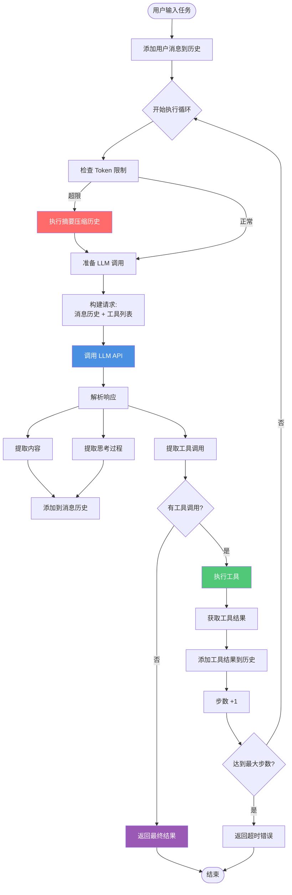
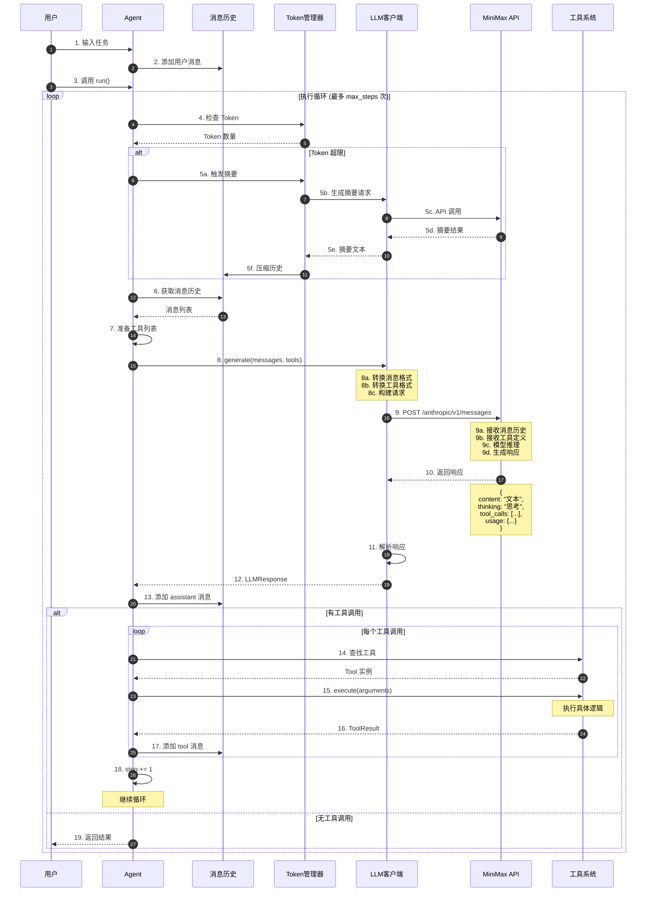
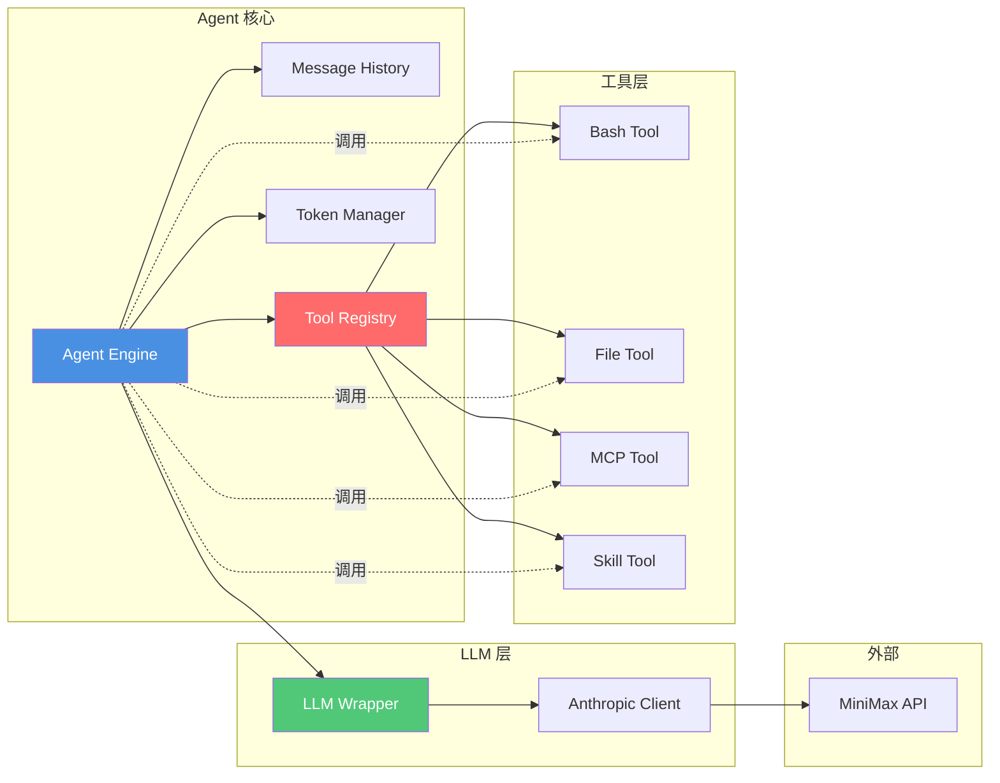
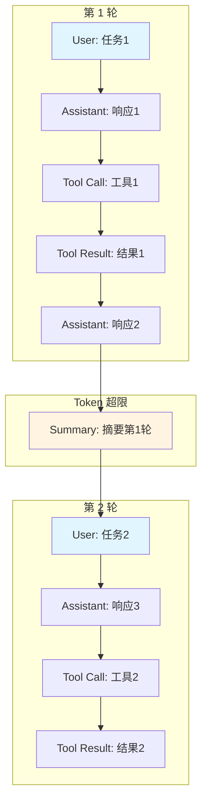
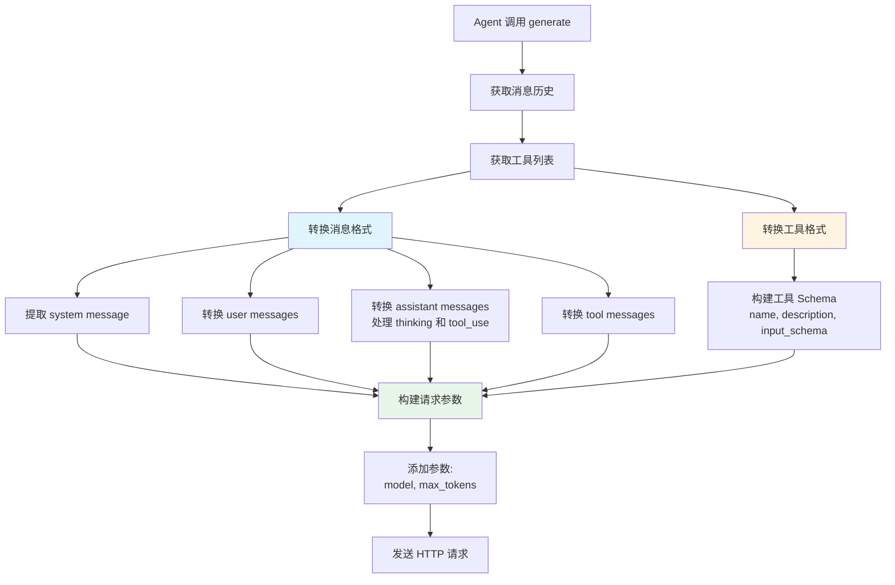
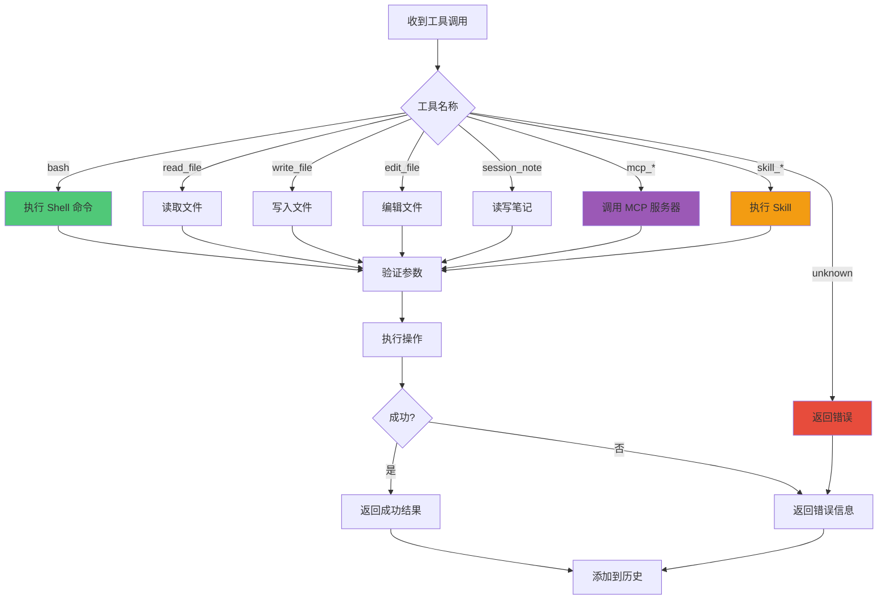

# Agent 核心交互流程图

## 简化版：Agent 与大模型交互流程



## 详细版：完整交互序列



## Agent 核心组件交互



## 消息流转过程



## LLM 请求构建过程



## 工具执行决策树



## 关键代码路径

### 1. Agent.run() 主循环
```python
async def run(self) -> str:
    step = 0
    while step < self.max_steps:
        # 1. 检查并摘要历史
        await self._summarize_messages()
        
        # 2. 调用 LLM
        response = await self.llm.generate(
            messages=self.messages, 
            tools=list(self.tools.values())
        )
        
        # 3. 添加 assistant 消息
        self.messages.append(assistant_msg)
        
        # 4. 检查工具调用
        if not response.tool_calls:
            return response.content  # 完成
        
        # 5. 执行工具
        for tool_call in response.tool_calls:
            result = await tool.execute(**arguments)
            self.messages.append(tool_msg)
        
        step += 1
```

### 2. LLM 调用链
```python
Agent.run()
  └─> LLMClient.generate()
      └─> AnthropicClient.generate()
          └─> _convert_messages()  # 消息格式转换
          └─> _convert_tools()     # 工具格式转换
          └─> _make_api_request()   # API 调用
              └─> client.messages.create()  # SDK 调用
```

### 3. 工具执行链
```python
Agent.run()
  └─> tool.execute(**arguments)
      ├─> BashTool.execute()      # Shell 命令
      ├─> FileTool.execute()      # 文件操作
      ├─> MCPTool.execute()       # MCP 服务器
      └─> SkillTool.execute()     # Skill 执行
```

## 性能优化点

1. **异步执行**: 所有 I/O 操作都是异步的
2. **Token 摘要**: 自动压缩历史，减少 Token 消耗
3. **工具缓存**: 工具实例复用，避免重复创建
4. **批量处理**: 多个工具调用可以并行执行（未来优化）
5. **日志异步**: 日志写入不阻塞主流程

## 错误处理策略

1. **LLM 调用失败**: 重试机制（RetryConfig）
2. **工具执行失败**: 捕获异常，返回错误 ToolResult
3. **Token 超限**: 自动摘要，避免上下文溢出
4. **步数超限**: 返回超时错误，防止无限循环
5. **工具不存在**: 返回明确的错误信息
