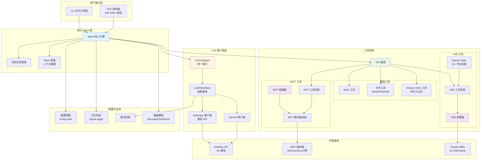
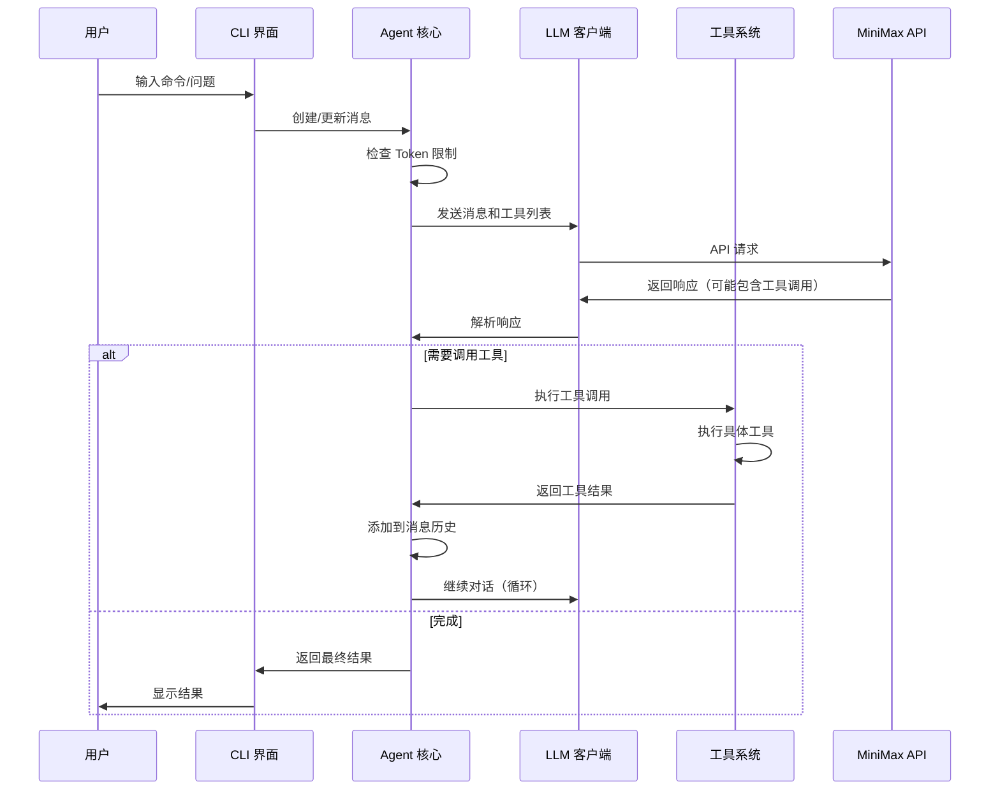
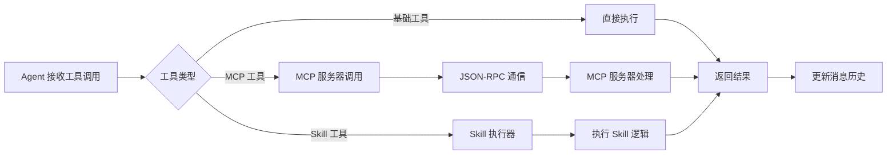

# Mini-Agent 架构图

## 系统架构概览

## 详细架构说明

### 1. 用户接口层

#### CLI (命令行界面)
- **文件**: `mini_agent/cli.py`
- **功能**: 
  - 交互式命令行界面
  - 支持多轮对话
  - 工作空间管理
  - 历史记录和自动补全

#### ACP 服务器
- **文件**: `mini_agent/acp/server.py`
- **功能**:
  - Agent Communication Protocol 实现
  - 与 Zed Editor 等编辑器集成
  - 提供标准化的 Agent 接口

### 2. 核心 Agent 层

#### Agent 核心引擎
- **文件**: `mini_agent/agent.py`
- **功能**:
  - 执行循环管理（最多 max_steps 步）
  - 工具调用协调
  - 消息历史管理
  - Token 限制和上下文摘要
  - 工作空间管理

#### 消息历史管理
- 维护对话历史
- 支持系统提示注入
- 自动上下文摘要（当 Token 超过限制时）

#### Token 管理
- 使用 `tiktoken` 精确计算 Token
- 自动触发摘要机制
- 支持长上下文处理

### 3. LLM 客户端层

#### LLMClientBase (抽象基类)
- **文件**: `mini_agent/llm/base.py`
- **功能**:
  - 定义统一的 LLM 接口
  - 消息格式转换
  - 请求准备和重试机制

#### Anthropic 客户端
- **文件**: `mini_agent/llm/anthropic_client.py`
- **功能**:
  - 兼容 Anthropic API 格式
  - 支持交错思维（interleaved thinking）
  - 工具调用处理

#### OpenAI 客户端
- **文件**: `mini_agent/llm/openai_client.py`
- **功能**:
  - OpenAI API 兼容
  - 函数调用支持

#### LLM Wrapper
- **文件**: `mini_agent/llm/llm_wrapper.py`
- **功能**:
  - 统一接口封装
  - 根据配置选择客户端

### 4. 工具系统

#### Tool 基类
- **文件**: `mini_agent/tools/base.py`
- **功能**:
  - 定义工具接口
  - Schema 转换（Anthropic/OpenAI）
  - 工具结果封装

#### 基础工具

**Bash 工具**
- **文件**: `mini_agent/tools/bash_tool.py`
- **功能**: 执行 Shell 命令（前台/后台）

**文件工具**
- **文件**: `mini_agent/tools/file_tools.py`
- **功能**: 文件读写和编辑

**Session Note 工具**
- **文件**: `mini_agent/tools/note_tool.py`
- **功能**: 跨会话持久化记忆

#### MCP 工具系统

**MCP 加载器**
- **文件**: `mini_agent/tools/mcp_loader.py`
- **功能**:
  - 从 `mcp.json` 读取配置
  - 启动 MCP 服务器进程
  - 管理服务器连接
  - 加载工具定义

**MCP 服务器连接**
- 通过 stdio 与 MCP 服务器通信
- JSON-RPC 2.0 协议实现
- 工具调用和响应处理

#### Skill 工具系统

**Skill 加载器**
- **文件**: `mini_agent/tools/skill_loader.py`
- **功能**:
  - 从 Git Submodule 加载 Skills
  - 解析 SKILL.md 文件
  - 提供 Skill 元数据

**Skill 工具包装**
- **文件**: `mini_agent/tools/skill_tool.py`
- **功能**: 将 Skill 转换为可执行的工具

**Claude Skills**
- **位置**: `mini_agent/skills/`
- **包含**: 15+ 专业技能
  - 文档处理（PDF, DOCX, PPTX）
  - 设计工具（Canvas, Brand Guidelines）
  - 测试工具（Web Testing）
  - 开发工具（MCP Builder, Skill Creator）
  - 其他专业工具

### 5. 配置与支持

#### 配置管理
- **文件**: `mini_agent/config.py`
- **功能**:
  - 读取 YAML 配置文件
  - API Key 和模型配置
  - 工作空间和参数设置

#### 日志系统
- **文件**: `mini_agent/logger.py`
- **功能**:
  - 请求/响应日志
  - 工具执行日志
  - 彩色终端输出

#### 重试机制
- **文件**: `mini_agent/retry.py`
- **功能**: API 调用失败重试

#### 数据模型
- **文件**: `mini_agent/schema/`
- **功能**: 
  - Message 模型
  - ToolResult 模型
  - LLMResponse 模型

### 6. 外部服务

#### MiniMax API
- M2 模型服务
- 支持交错思维
- 工具调用能力

#### MCP 服务器
- 外部 MCP 服务器（如 Memory, Search）
- 通过 stdio 通信
- JSON-RPC 协议

#### Claude Skills 仓库
- Git Submodule
- 专业技能集合
- 动态加载

## 数据流

## 工具调用流程

## 关键特性

1. **模块化设计**: 清晰的层次结构，易于扩展
2. **多 LLM 支持**: 统一的接口支持不同 LLM 提供商
3. **丰富的工具生态**: 基础工具 + MCP + Skills
4. **智能上下文管理**: 自动摘要，支持长对话
5. **持久化记忆**: Session Note 工具跨会话保存信息
6. **标准化协议**: 支持 ACP 和 MCP 协议
7. **完善的日志**: 详细的执行日志便于调试

## 扩展点

- **添加新工具**: 继承 `Tool` 基类
- **添加新 LLM 客户端**: 实现 `LLMClientBase`
- **添加新 Skill**: 在 `skills/` 目录添加 SKILL.md
- **集成新 MCP 服务器**: 在 `mcp.json` 中配置
