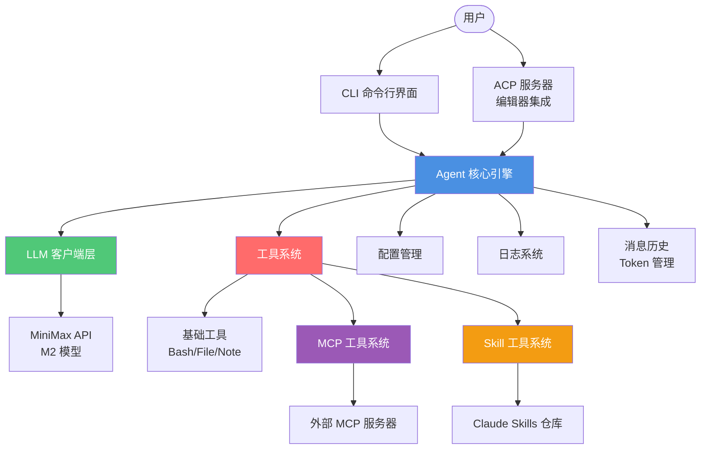
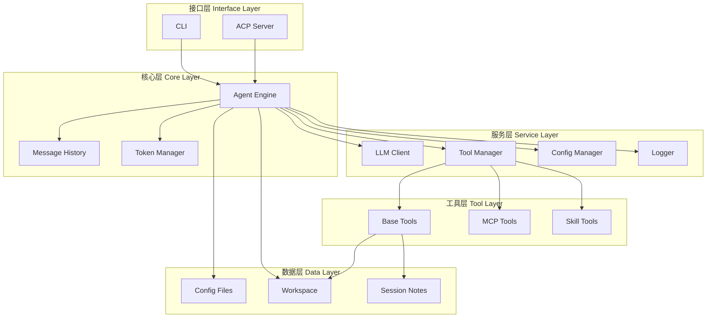
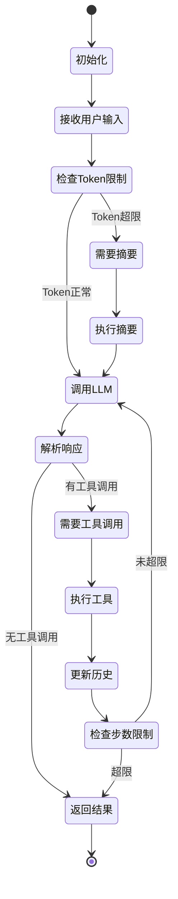
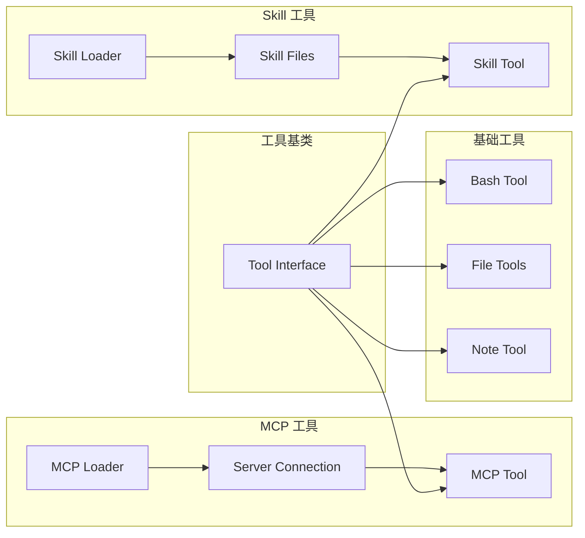
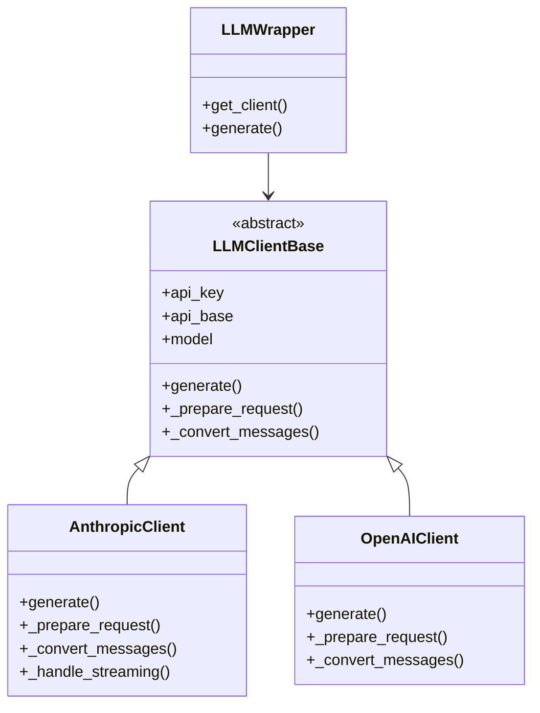
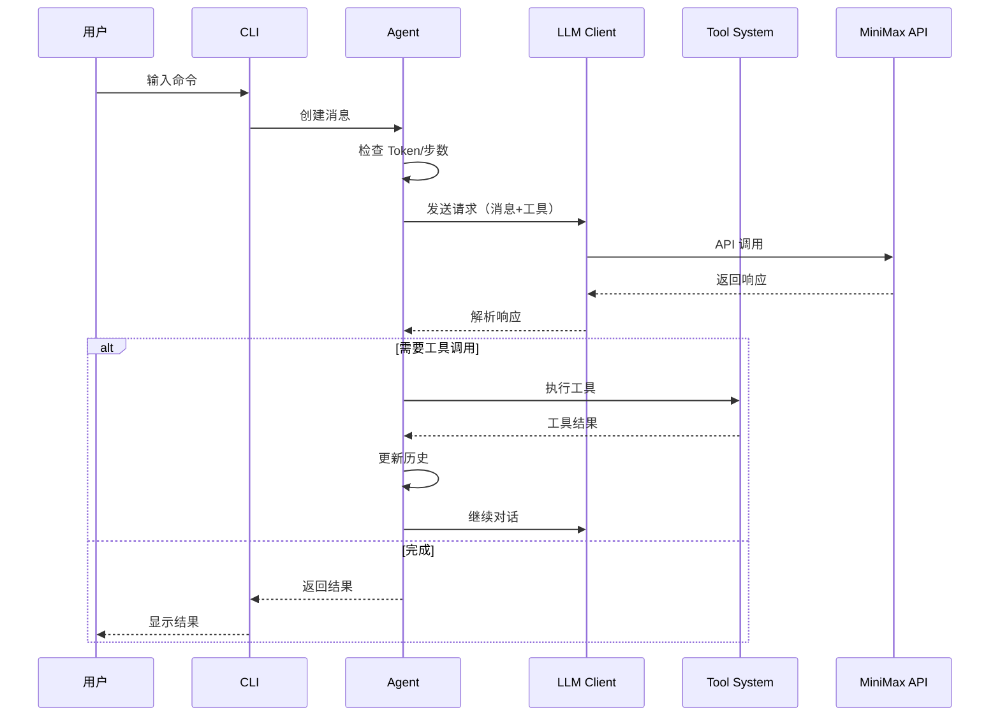

# Mini-Agent 架构图（简化版）

## 整体架构



## 核心组件层次结构



## Agent 执行循环



## 工具系统架构



## LLM 客户端架构



## 数据流图



## 文件结构映射

```
mini_agent/
├── cli.py              # CLI 入口
├── agent.py            # Agent 核心
├── config.py           # 配置管理
├── logger.py           # 日志系统
├── retry.py            # 重试机制
│
├── llm/                # LLM 客户端层
│   ├── base.py         # 抽象基类
│   ├── anthropic_client.py
│   ├── openai_client.py
│   └── llm_wrapper.py
│
├── tools/              # 工具系统
│   ├── base.py         # 工具基类
│   ├── bash_tool.py    # Bash 工具
│   ├── file_tools.py   # 文件工具
│   ├── note_tool.py    # Session Note
│   ├── mcp_loader.py   # MCP 加载器
│   ├── skill_loader.py  # Skill 加载器
│   └── skill_tool.py   # Skill 工具
│
├── skills/             # Claude Skills
│   ├── document-skills/
│   ├── canvas-design/
│   ├── webapp-testing/
│   └── ... (15+ skills)
│
├── schema/             # 数据模型
│   └── schema.py
│
├── acp/                # ACP 服务器
│   └── server.py
│
└── config/             # 配置文件
    ├── config.yaml
    ├── mcp.json
    └── system_prompt.md
```

## 关键设计模式

1. **策略模式**: LLM 客户端可插拔
2. **工厂模式**: 工具动态加载
3. **适配器模式**: MCP/Skill 工具适配
4. **观察者模式**: 日志和回调机制
5. **模板方法**: Agent 执行循环

## 扩展指南

### 添加新工具
```python
class MyTool(Tool):
    @property
    def name(self) -> str:
        return "my_tool"
    
    async def execute(self, **kwargs) -> ToolResult:
        # 实现工具逻辑
        pass
```

### 添加新 LLM 客户端
```python
class MyLLMClient(LLMClientBase):
    async def generate(self, messages, tools):
        # 实现 LLM 调用
        pass
```

### 添加新 Skill
1. 在 `skills/` 目录创建新文件夹
2. 添加 `SKILL.md` 文件
3. 使用 `SkillLoader` 自动加载

### 集成新 MCP 服务器
在 `config/mcp.json` 中添加配置：
```json
{
  "mcpServers": {
    "my_server": {
      "command": "npx",
      "args": ["-y", "@modelcontextprotocol/server-my"]
    }
  }
}
```
